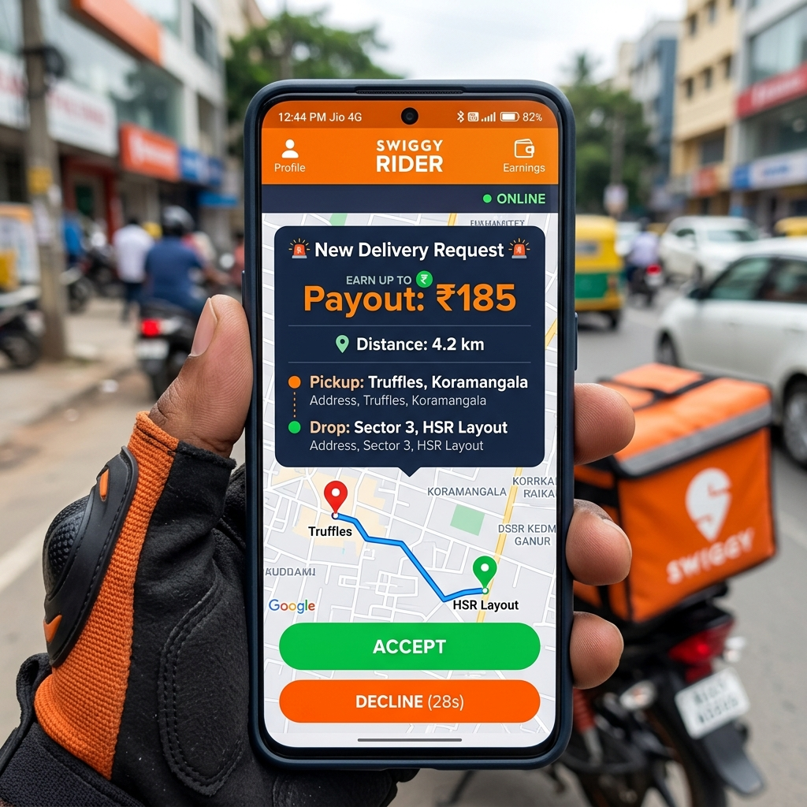
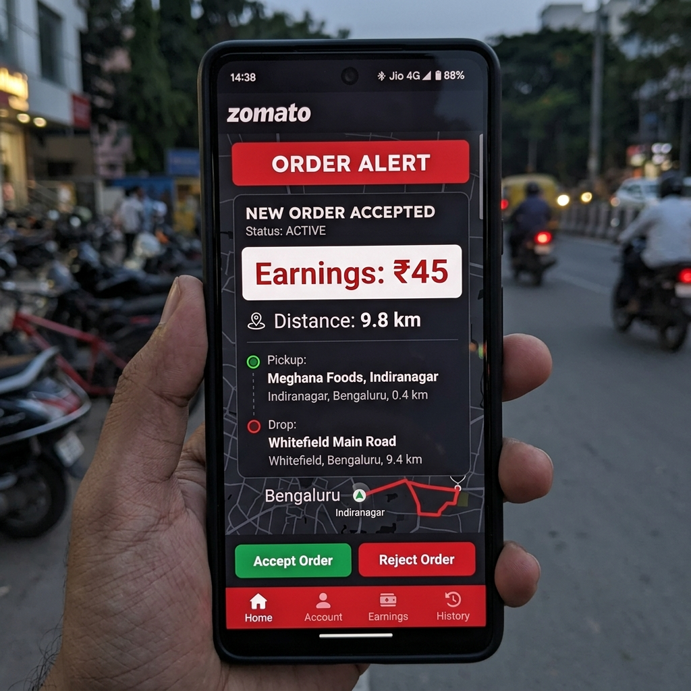
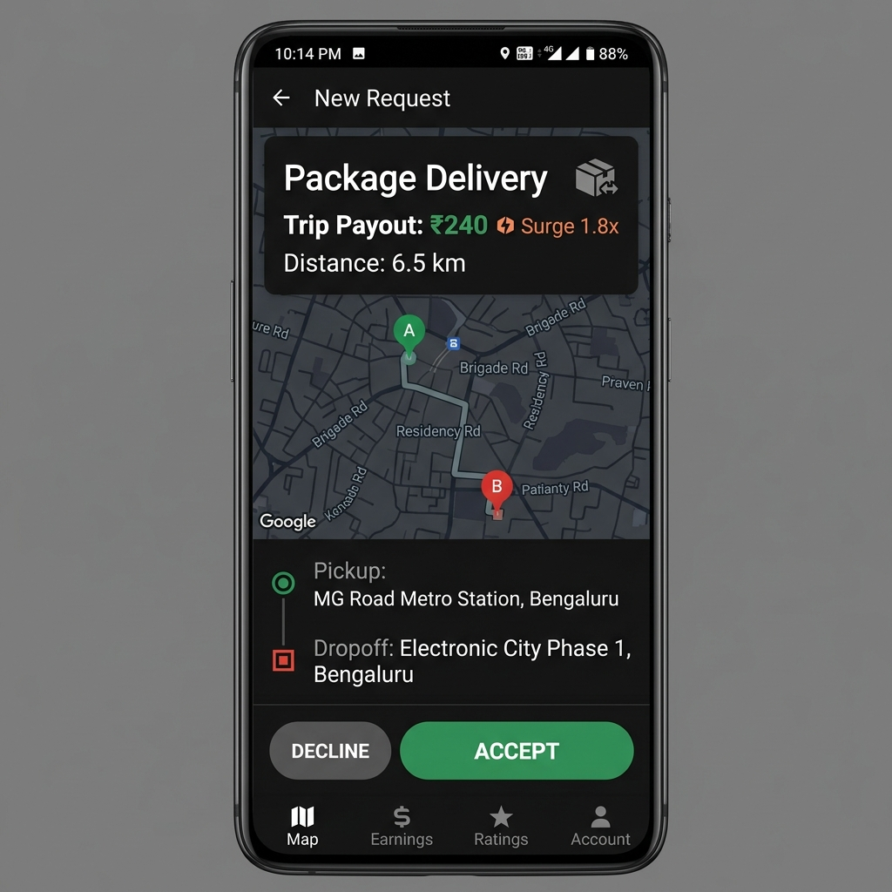
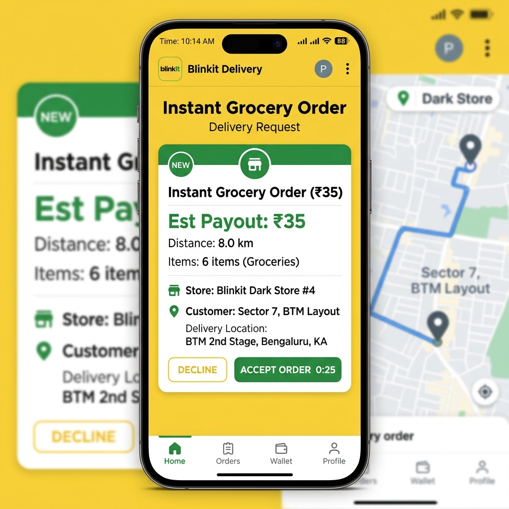

# GigPilot AI

Submission for the Hackathon  

### Problem Statement Chosen
- **Domain**: GigShield
- **Problem Statement**: Proactive AI Copilot and Rights Advisor for Gig-Workers to optimize shift earnings, evaluate order profitability, protect health, and prevent exploitation.

---

### Team
- **Team Name**: GigPilot Crew

---

### Our Solution
GigPilot AI is a proactive, real-time companion application designed specifically for delivery riders and gig workers. Instead of merely logging past trips, GigPilot AI analyzes live traffic, weather surges, and driver density to guide workers to high-yield hotspots before demand shifts occur. It includes an **AI Screenshot OCR Profit Analyzer** that parses uploaded order slips to calculate true net income after fuel and idling delays, protecting workers from underpaid orders. Additionally, it tracks continuous driving hours with **Burnout Guardian** and offers multilingual AI rights advisory.

---

### AI Component

● **What AI is used:**
- **Groq Llama 3.3-70B via API**: Powers the multilingual Copilot Q&A chatbot and rights advisor.
- **Tesseract.js Client-Side OCR Engine**: Extracts payout (₹), distance (km), platform name, and locations directly from uploaded order screenshots.
- **OpenWeatherMap & TomTom Live Traffic AI Engines**: Fetches real-time weather surge multipliers, traffic segment delays, and driver competition ratios.

● **What it does in your app:**
1. **Screenshot OCR Profit/Loss Detector**: Parses order slip screenshots to calculate base fuel cost, idling traffic penalties, profit margin %, and real hourly rate.
2. **Opportunity Radar**: Sweeps 360 degrees around worker coordinates to recommend optimal shift locations based on low competition and high surge rates.
3. **Multilingual Copilot Q&A**: Answers worker queries regarding fuel prices (₹110.93–₹111.68/L), shift spending, earnings summaries, and fair fare benchmarks.

● **Why we chose this approach:**
A rule-backed hybrid approach ensures zero-latency deterministic decisioning during live navigation while leveraging LLMs and OCR for natural language assistance and document vision. This eliminates black-box hallucinations and guarantees exact financial accuracy for gig workers.

---

### Tech Stack
● **Frontend**: React.js (v18), Tailwind CSS, Lucide Icons, Vite, Tesseract.js  
● **Backend**: Node.js, Express.js, Axios, Dotenv  
● **AI/ML**: Groq Llama 3.3-70B LLM, Tesseract OCR Engine  
● **Database/Storage**: SQLite3 + Dual In-Memory Store  
● **Other tools/APIs**: TomTom Live Traffic & Routing API, OpenWeatherMap API, Google Maps Directions API  

---

### Features Implemented

#### **Core Requirements:**
- [x] **Real-Time Opportunity Radar**: 360-degree rotating radar beam with spaced-out Google Maps location pins displaying live hourly rates (`₹322/hr`, `₹270/hr`).
- [x] **AI Screenshot OCR Analyzer**: Upload or pick sample order slips (Swiggy, Zomato, Uber, Blinkit) to parse payout, distance, fuel expenses, and profit vs loss.
- [x] **Smart Location & Competition Engine**: Calculates net hourly yield considering live driver density, travel distance, and time-of-day peak windows (Lunch Rush, Dinner Prime).
- [x] **Direct Google Maps Navigation**: One-click **Route** button opens turn-by-turn navigation directly to high-profit zones.
- [x] **Shift & Burnout Guardian**: Monitors continuous driving hours ($\ge 4.0\text{h}$) and triggers fatigue alerts to protect worker safety.
- [x] **GigDNA Reputation Index**: 5-dimensional score (`Reliability`, `Safety`, `Efficiency`, `Income Stability`, `Customer Happiness`) reacting dynamically to worker decisions.

#### **Bonus Features Attempted:**
- [x] **Multilingual Support**: Supports 7 regional Indian languages (English, Hindi, Kannada, Bengali, Marathi, Telugu, Tamil).
- [x] **Live TomTom Traffic Surcharge**: Integrates TomTom Traffic Flow API to add idling fuel penalties to congested order routes.
- [x] **Smart Chatbot Intent Engine**: Answers petrol/fuel rate queries (`₹110.93–₹111.68/L`), daily fuel expenses, and shift summaries accurately.
- [x] **Dark / Light Aesthetic Design**: Custom human-centric aesthetic brand mark and theme toggle.

---

### How to Run This Project

```bash
# 1. Clone the repo
git clone https://github.com/Tusharjain-19/gigpilot.git
cd gigpilot

# 2. Install dependencies (Root, Client, Server)
npm install
npm --prefix client install
npm --prefix server install

# 3. Copy example env file and fill in your keys
cp .env.example .env
cp server/.env.example server/.env

# 4. Run full application (Frontend + Backend concurrently)
npm run dev:all
```

If your project needs an API key to run, make sure `.env.example` is up to date so judges can test it easily (or provide a demo mode/mock key if the key is private).

---

### Environment Variables (.env)
```env
GROQ_API_KEY=your_groq_api_key_here
PORT=5000
TOMTOM_API_KEY=your_tomtom_api_key_here
WEATHER_API_KEY=your_openweather_api_key_here
```

---

### Screenshots

| Swiggy High Yield Order | Zomato Underpaid Order |
| :---: | :---: |
|  |  |

| Uber Package Surge Order | Blinkit Quick Commerce Order |
| :---: | :---: |
|  |  |
